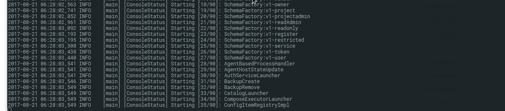
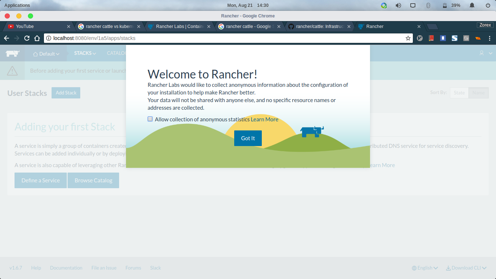

Setting Up Rancher
=================

I have here a checklist of what you need to do before we go
to actually rancher setup

.. hlist::
  :columns: 1

  * Your machines must have linux installed (eg. Ubuntu, Centos, etc)
  * `Install Docker <https://docs.docker.com/engine/installation/>`_
  * Choose the `supported docker versions <http://rancher.com/docs/rancher/v1.6/en/hosts/#supported-docker-versions>`_ of Rancher

Once you complete the pre-setup procedures, you can now start your server aka
Rancher Manager by doing this:

.. code-block:: guess

   docker run -d --restart=unless-stopped -p 8080:8080 --name rancher-server rancher/server;
   docker logs -f rancher-server;

This will take a while specially if you haven't pull the rancher/server image yet.

The code above lets you run the rancher-server container which will trigger initialization
setups (usually it takes about 5 minutes) and the other one will tail the logs of
the container to monitor if it initializes properly.

After the initialization process, you can now access the rancher-server by typing-in
http://localhost:8080 on your browser. Here's what it will look like:

Once you see this page, that's it! You already finished the Rancher Server setup!
